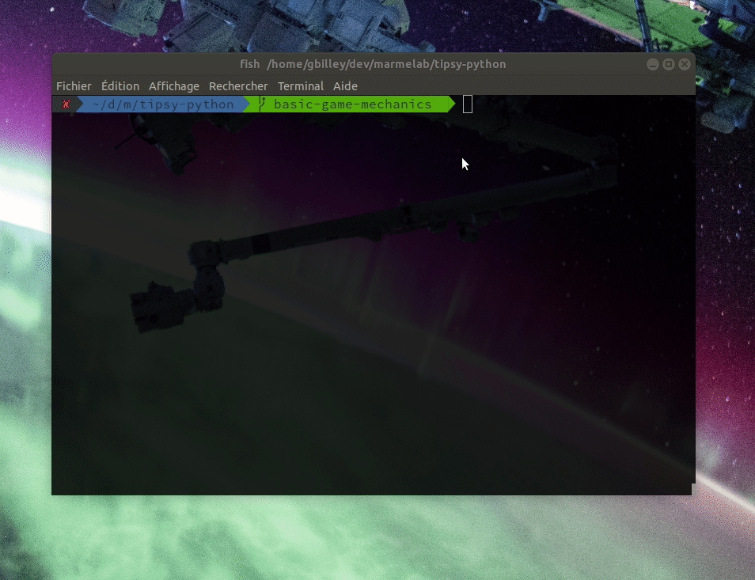

# tipsy-python

> Give it a lift & make 'em shift

Tipsy is a game were the board can be tilt to move puck out of it. The aime is to be the first to get all 6 of your pucks out, or to exit the black pug.



## How to install

```
make install
```

## How to run

```
make run
```

## How to test

```
make test
```
