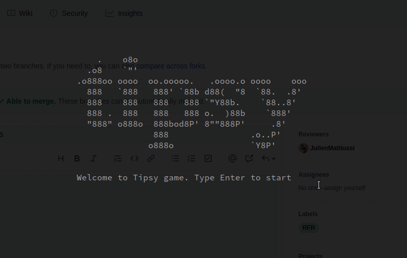

# tipsy-python

> Give it a lift & make 'em shift

Tipsy is a game were the board can be tilt to move puck out of it. The aim is to be the first to get all 6 of your pucks out, or to exit the black puck.
Each time a puck go out of the board, it is flipped and replaced on the board.

The game is separated in 3 layers :
- [game.py](./src/game.py) : The game logic
- [game_renderer.py](./src/game_renderer.py) : The rendering logic
- [board.py](./src/board.py) : The board representation
- [tipsy.py](./src/tipsy.py) : The main program



## How to install

```
make install
```

## How to run

```
make run
```

## How to test

```
make test
```
